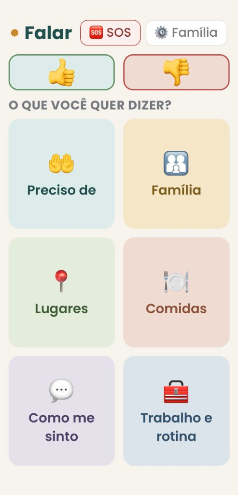
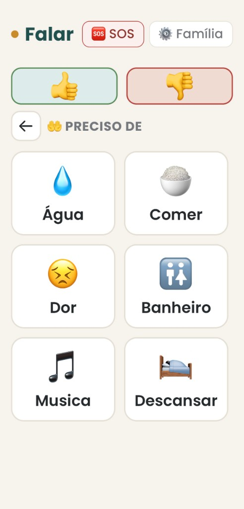
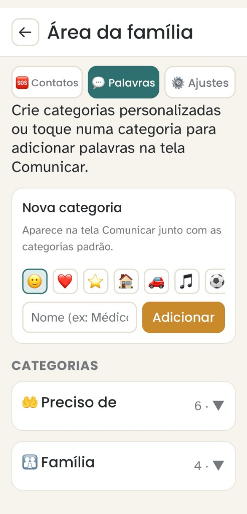
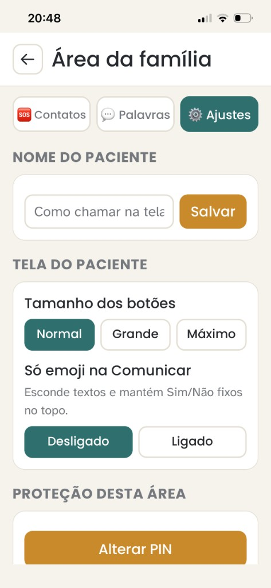

# Falar

[](https://github.com/Manuelaalvess/falar-app/actions/workflows/ci.yml)

App mobile de **Comunicação Alternativa (CAA)** para quem teve AVC e ficou com afasia. O paciente toca em categorias e itens com emoji; o app fala em voz alta. Inclui botão de emergência (1 toque lista contatos, 2 toques rápidos ligam e avisam a família por push).

Desenvolvido a partir de um caso real: meu pai perdeu parte da fala depois do AVC, e eu cuido sozinha. O escopo é uma família com dois celulares na mesma conta, não um produto clínico multi-tenant.

**Stack:** Expo · React Native · TypeScript · Firebase · Zustand · Jest

## Funcionalidades

| Área | O que faz |
| ---- | --------- |
| **Comunicar** | Sim/Não fixos no topo; categorias padrão + personalizadas; emoji + TTS pt-BR |
| **SOS** | No header: 1 toque abre contatos; 2 toques rápidos ligam e registram alerta com GPS |
| **Push** | Outros aparelhos logados recebem notificação no duplo toque (sem Cloud Functions) |
| **Família** | 3 abas: Contatos, Palavras (itens e categorias), Ajustes (nome, fonte, PIN, evolução) |
| **Evolução** | Resumo de uso para fonoaudiologia, com compartilhar (aba Ajustes) |
| **Offline parcial** | Itens e contatos em cache após login |
| **Acessibilidade** | Grade CAA, emoji + TTS, modo baixo letramento, escala de fonte, alvos ≥48 px |

## Demo

Validado em **05/08/2026** nos dois celulares da família (mesma conta Firebase): Comunicar, SOS, push, PIN e resumo para fono.

| Comunicar (home) | Comunicar (categoria) |
| --- | --- |
|  |  |

| Família, Palavras | Família, Ajustes |
| --- | --- |
|  |  |

Mais capturas em [`docs/screenshots/`](docs/screenshots/).

## Rodando localmente

Requisitos: Node.js 20+, npm, Expo Go ou emulador Android/iOS.

```bash
git clone https://github.com/Manuelaalvess/falar-app.git
cd falar-app
npm install
cp .env.example .env
npm start
```

Comandos úteis:

```bash
npm run android      # emulador ou dispositivo
npm run lint
npm run typecheck
npm run test:ci      # igual ao CI
npm run validate     # typecheck + lint + testes
```

### Variáveis de ambiente

Arquivo `.env` (modelo em `.env.example`), prefixo `EXPO_PUBLIC_`:

| Variável | Descrição |
| -------- | --------- |
| `EXPO_PUBLIC_FIREBASE_API_KEY` | API key do Firebase |
| `EXPO_PUBLIC_FIREBASE_AUTH_DOMAIN` | Domínio Auth |
| `EXPO_PUBLIC_FIREBASE_PROJECT_ID` | ID do projeto |
| `EXPO_PUBLIC_FIREBASE_MESSAGING_SENDER_ID` | Sender ID |
| `EXPO_PUBLIC_FIREBASE_APP_ID` | App ID |

No Firebase Console: Authentication → Phone habilitado. Para desenvolvimento, use números de teste em *Phone numbers for testing*.

Login usa reCAPTCHA em WebView (`RecaptchaVerifierModal.tsx`); funciona no Expo Go.

### Build para dispositivo (EAS)

```bash
npx eas-cli login
npx eas-cli build --profile preview --platform android
```

Gera APK interno. Detalhes em [`ARCHITECTURE.md`](ARCHITECTURE.md).

## Estrutura do código

```
src/
  screens/              Login, Comunicar, admin (família)
  components/           SOS, PIN, reCAPTCHA
  components/comunicar/ Grids e overlay da tela principal
  hooks/                Auth, Firestore, push, ações do paciente
  services/             Firebase, TTS, push, emergência, categorias
  store/                Zustand (dados + preferências)
  utils/                Personalização, stats de evolução
  validation/           Zod (formulários admin)
  types/                Tipos TypeScript
  theme/                Cores e tipografia
  constants/            Categorias e itens padrão
```

## Acessibilidade e CAA

O Falar segue princípios de **Comunicação Alternativa e Aumentativa** para afasia pós-AVC: layout em grade semântica, multimodalidade (emoji + voz), botões grandes (WCAG 2.5.5), fonte Atkinson Hyperlegible e modo baixo letramento (só símbolos + Sim/Não fixos).

Decisões de design com referências (ASHA, OpenAAC, estudos com afasia e revisão sobre apps para 60+): [`docs/ACESSIBILIDADE.md`](docs/ACESSIBILIDADE.md).

## Documentação

| Documento | Conteúdo |
| --------- | -------- |
| [`ARCHITECTURE.md`](ARCHITECTURE.md) | Firestore, SOS, push, offline, segurança |
| [`docs/ACESSIBILIDADE.md`](docs/ACESSIBILIDADE.md) | CAA, idosos, baixo letramento: princípios e referências |
| [`docs/REQUISITOS.md`](docs/REQUISITOS.md) | Requisitos funcionais e critérios de aceite |
| [`docs/TESTE_MANUAL.md`](docs/TESTE_MANUAL.md) | Roteiro de validação em 2 aparelhos |

## Qualidade

Push/PR na branch `master` executa typecheck, ESLint e Jest (`.github/workflows/ci.yml`). **18 testes** unitários (utils, auth, SOS).

## Licença

[MIT](LICENSE)
